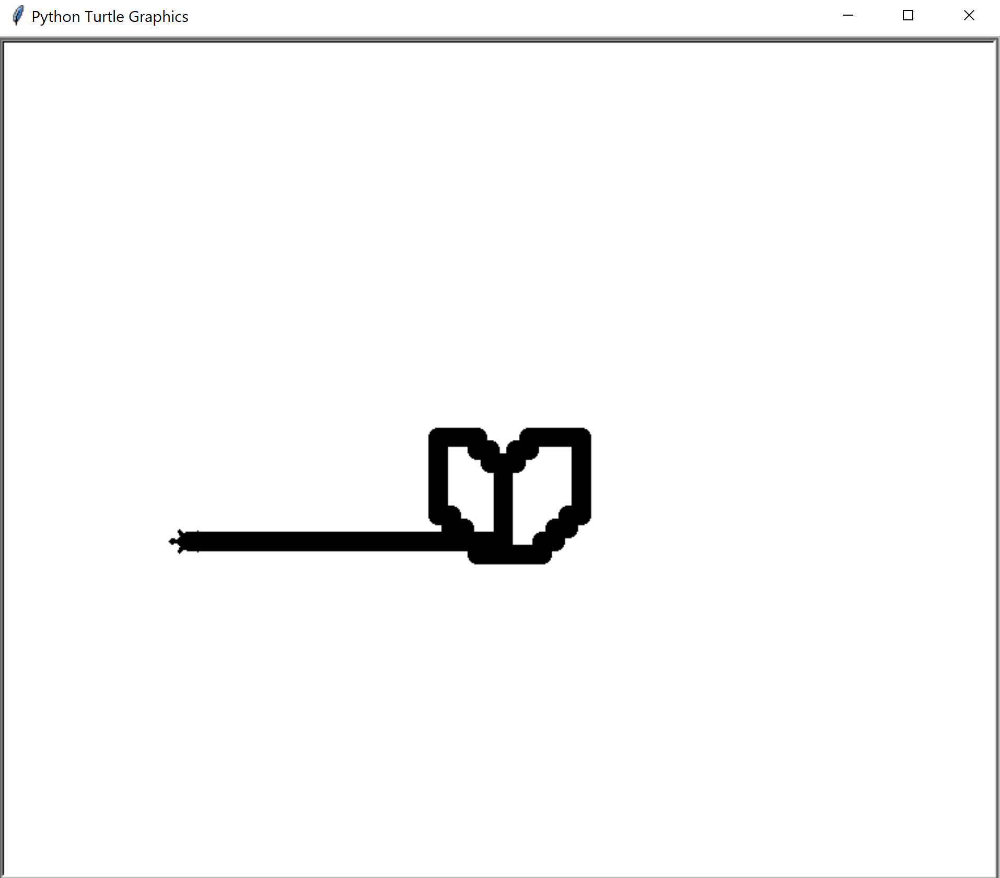

# <div align = "center"> Control Turtle
In this tutorial, we will be learning how to use the arrow keys to control where the turtle moves!

Difficulty (out of 5): 🌶

This Tutorial Includes:
* 



---
To start with, we need to actually import Turtle into Python 3:

``` python
import turtle
```
Next, let's set up some movement functions!

``` python
import turtle

turtle.listen()

def left():
    turtle.setheading(180)
    turtle.forward(10)

turtle.onkeypress(left, "Left")
turtle.mainloop()
```
Test this by pressing the left arrow key! `turtle.listen()` allows the turtle to listen for input. In the `left` function, the turtle will face the direction it is moving, then move forward by `10`. `turtle.mainloop()` just keeps the program running. How about we make a variable to control how far the turtle moves when you press the left arrow key?
``` python
import turtle

turtle.listen()
tspeed = 10

def left():
    turtle.setheading(180)
    turtle.forward(tspeed)

turtle.onkeypress(left, "Left")
turtle.mainloop()
```
Test this, it should work the same. If you mess with the variable, for example `tspeed = 20` you will see that the turtle moves left faster. Make sure to turn the speed back down to `10` afterwards though. But only moving left is quite boring, how about we add the rest of the arrow keys?
``` python
import turtle

turtle.listen()
tspeed = 10

def left():
    turtle.setheading(180)
    turtle.forward(tspeed)

def right():
    turtle.setheading(0)
    turtle.forward(tspeed)

def down():
    turtle.setheading(270)
    turtle.forward(tspeed)

def up():
    turtle.setheading(90)
    turtle.forward(tspeed)

turtle.onkeypress(left, "Left")
turtle.onkeypress(right, "Right")
turtle.onkeypress(down, "Down")
turtle.onkeypress(up, "Up")
turtle.mainloop()
```
What about we neaten things up a little now? Make the pen size larger, change the shape of the turtle or even make the turtle super speedy! Try this!
``` python
import turtle

turtle.speed(0)
turtle.shape("turtle")
turtle.pensize(15)
turtle.listen()
tspeed = 10

def left():
    turtle.setheading(180)
    turtle.forward(tspeed)
    
def right():
    turtle.setheading(0)
    turtle.forward(tspeed)

def down():
    turtle.setheading(270)
    turtle.forward(tspeed)

def up():
    turtle.setheading(90)
    turtle.forward(tspeed)

turtle.onkeypress(left, "Left")
turtle.onkeypress(right, "Right")
turtle.onkeypress(down, "Down")
turtle.onkeypress(up, "Up")
turtle.mainloop()
```
Well done! You've just made a  turtle which you can control with arrow keys!
### WAIT, WAIT UP! Before you go and get another tutorial up, try:
# <div align = "center"> 🎉 PERSONALISING 🎉
* Change up the pen colour of the turtle using `turtle.pencolor("red")`
* Try adding an extra button, for example when pressing space the pen will go down or up.
* Change the background colour.

Or anything else, make this project your own!

## <div align = "center"> Go Make Stuff and be Awesome!