<link rel="stylesheet" href="../layouts/worksheet.css">

#
# 
 Scratch Rocket Lander

In this tutorial, we will be creating a game where you must land your rocketship onto the landing pad, but watch out, if you land it wrong your rocketship will crash!

Difficulty (out of 5): 🌶🌶

**This Tutorial Includes**

* Variables
* Clones

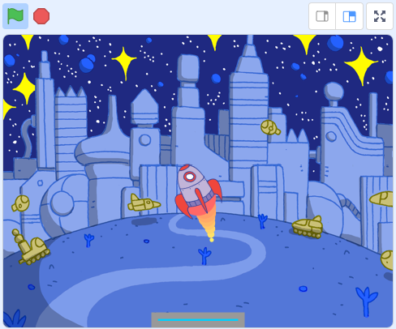

#
# Step 1: Rocket Movement.

## Setup

To start with, let's delete `sprite 1` (the cat) and add the `Rocketship` sprite found in the Scratch sprite library.

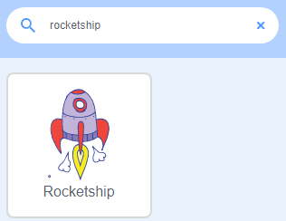

> View the costumes of this sprite and delete all but `rocketship-e`.

Finally, make sure to resize your `Rocketship` to `size = 50`.

## Code

Add these blocks of code to your `Rocketship` sprite so that the player can use the up arrow key to move the Rocketship up.

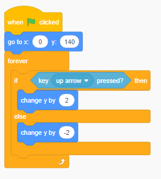

Test your code and watch the `Rocketship` move up as you use the up key.

> For the next part, ***create a variable called `direction`.***

Continuing, add this to your code. When the player presses left, the Rocketship tilts toward the left of the screen. When the player presses right, the Rocketship tilts toward the right of the screen.

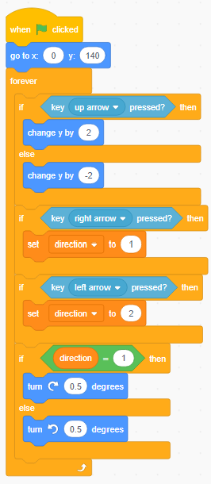

Test your code and watch the `Rocketship` tilt when your use the left and right arrow keys.

Finally, let's make our rocketship start in a random direction.

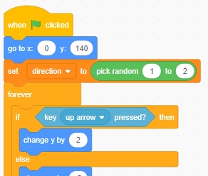

Test your code. This is what the end product should look like for this step.

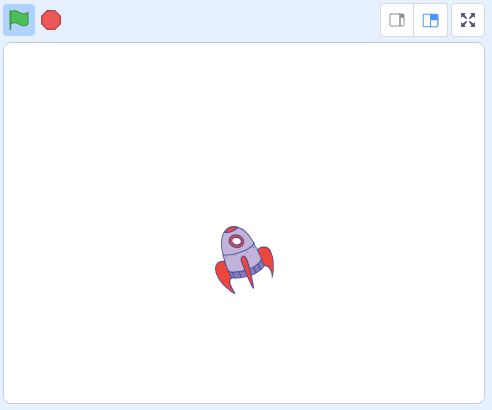

> ## This would be a good time to save your project.

#
# Step 2: Fire

## Setup

First, let's add the `Ball` sprite from the Scratch sprite library.

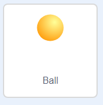

Go into the costumes and delete all except for one (it does not matter which). Use the fill bucket tool to paint the ball a solid red.

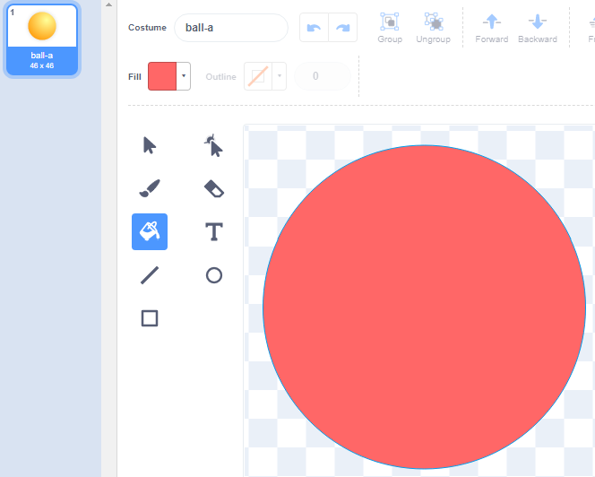

Finally, make sure to resize your `Ball` to `size = 85`.

## Code

Add these blocks of code to your `Ball` sprite so that it follows the `Rocketship` on the back layer in the direction of the bottom of the `Rocketship`. As well as this, when the player presses the up arrow key, the `Ball` sprite will clone itself.

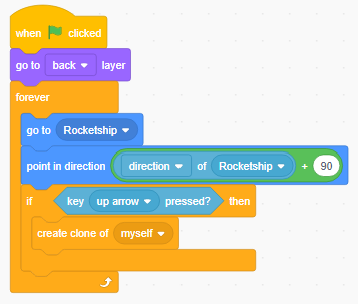

Continuing, let's tell our clones to move 5 steps, change their colour and change their size all 10 times before deleting the clone.

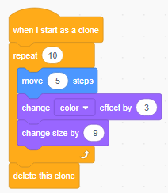

Test your code and watch the fire coming out of the `Rocketship` as you move it.

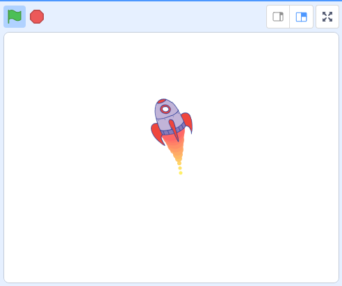

> ## This would be a good time to save your project.

#
# Step 3: Landing Pad

## Setup

For our next step, we need one more sprite. Add the `Paddle` sprite from the Scratch sprite library.

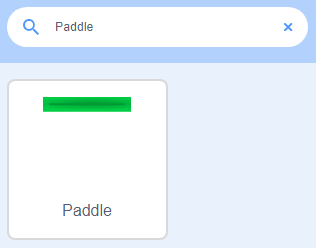

Recolour the `Paddle` to look like a futuristic landing pad!

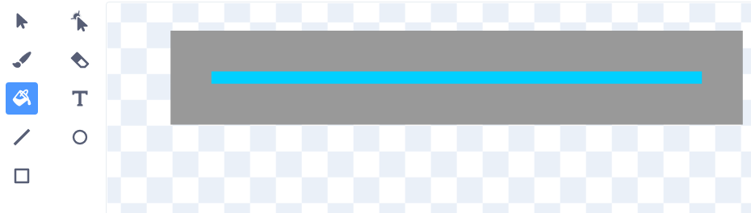

Finally, add a space themed background! I would suggest one of these:

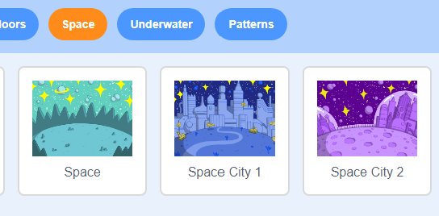

## Code

All we need to add to the `Paddle` sprite is this one block of code which makes sure that the paddle is in position for the player to land the `Rocketship` onto it.

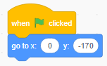

Test your code and you should see the `Paddle` move to the bottom of the stage.

> ## This would be a good time to save your project.

#
# Step 4: Touch Down

## Code

Moving back to the `Rocketship`, add this piece of code to make the `Rocketship` aware of when it is touching the `Paddle`, then check whether the `Rocketship` is upright enough to survive the landing! Then the code will stop, and your game is completed!

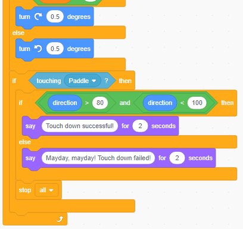

Test your code. This is what your code on the `Rocketship` should look like now.

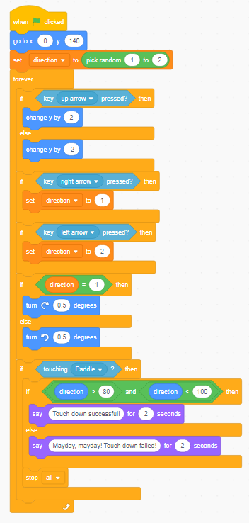

This is the end result. I hope you enjoyed this tutorial.

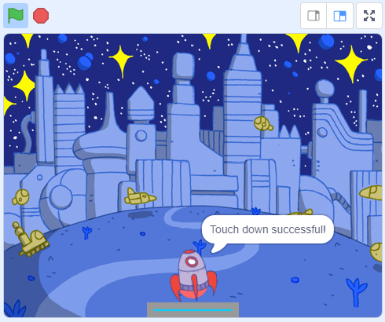

> ## This would be a good time to save your project.

### WAIT, WAIT UP! Before you go, try:
# 
 🎉 PERSONALISING 🎉
* Add different levels with different backgrounds.
* Make the range that the direction must be to win smaller.
* Make the `Rocketship` explode when touch down has failed!

Or anything else, make this project your own!

## 
 Go Make Stuff and be Awesome!